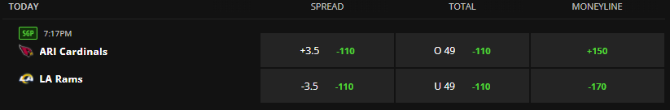

<!-- README.md is generated from README.Rmd. Please edit that file -->

# NFLpredictions

<!-- badges: start -->
<!-- badges: end -->

This package functions that make make it easy to analyze betting lines
for NFL games.

## Installation

You can install the development version of NFLpredictions from
[GitHub](https://github.com/) with:

``` r
# install.packages("devtools")
devtools::install_github("przybylee/NFLpredictions")
```

## Example

Suppose we are considering placing a wager on a first round playoff game
between the Cardinals and the Rams.



``` r
library(NFLpredictions)
## basic example code
```

What is special about using `README.Rmd` instead of just `README.md`?
You can include R chunks like so:

``` r
summary(cars)
#>      speed           dist       
#>  Min.   : 4.0   Min.   :  2.00  
#>  1st Qu.:12.0   1st Qu.: 26.00  
#>  Median :15.0   Median : 36.00  
#>  Mean   :15.4   Mean   : 42.98  
#>  3rd Qu.:19.0   3rd Qu.: 56.00  
#>  Max.   :25.0   Max.   :120.00
```

You’ll still need to render `README.Rmd` regularly, to keep `README.md`
up-to-date. `devtools::build_readme()` is handy for this. You could also
use GitHub Actions to re-render `README.Rmd` every time you push. An
example workflow can be found here:
<https://github.com/r-lib/actions/tree/v1/examples>.

You can also embed plots, for example:

In that case, don’t forget to commit and push the resulting figure
files, so they display on GitHub and CRAN.
